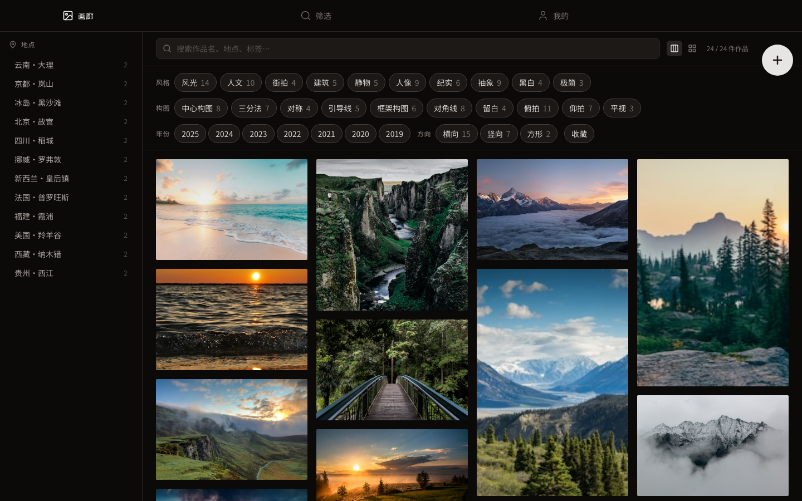
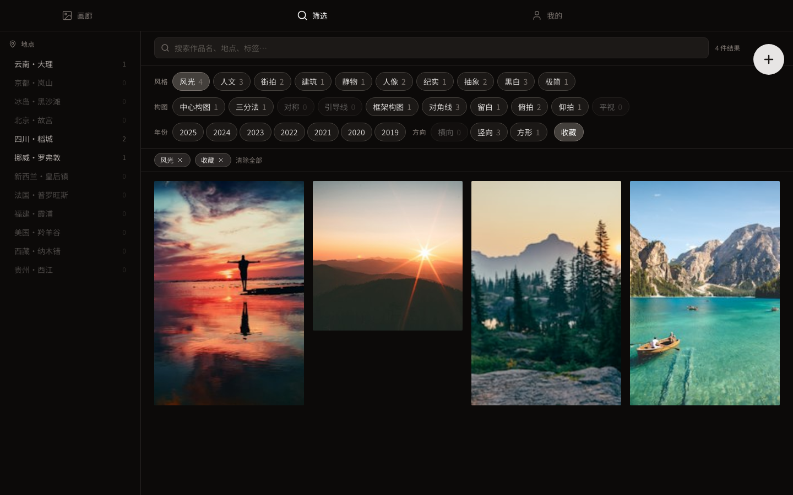
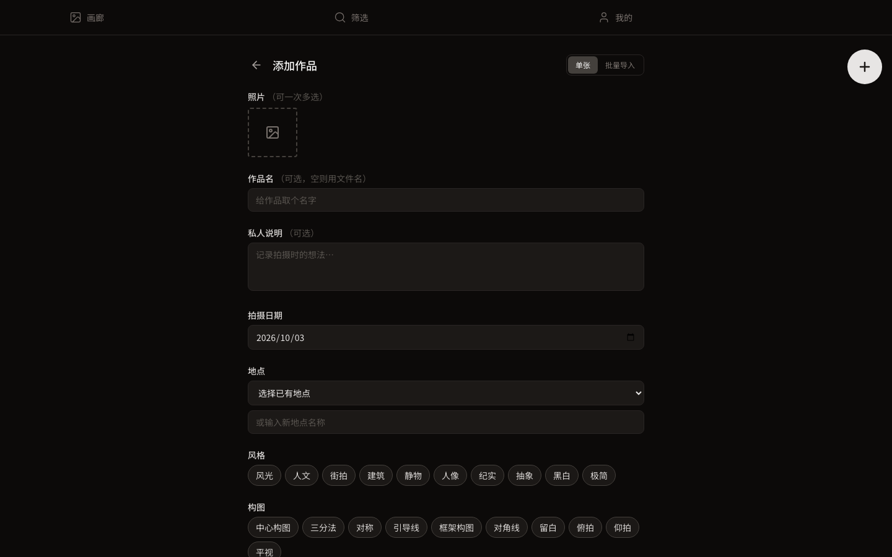
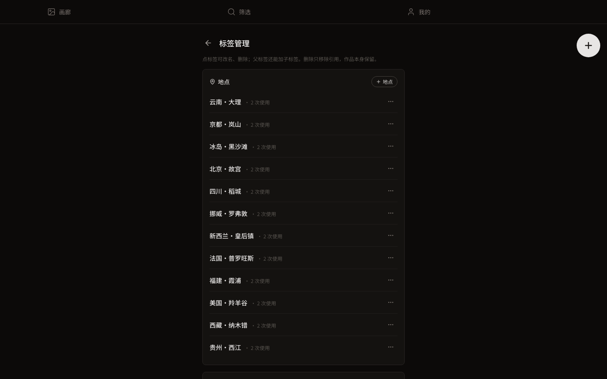
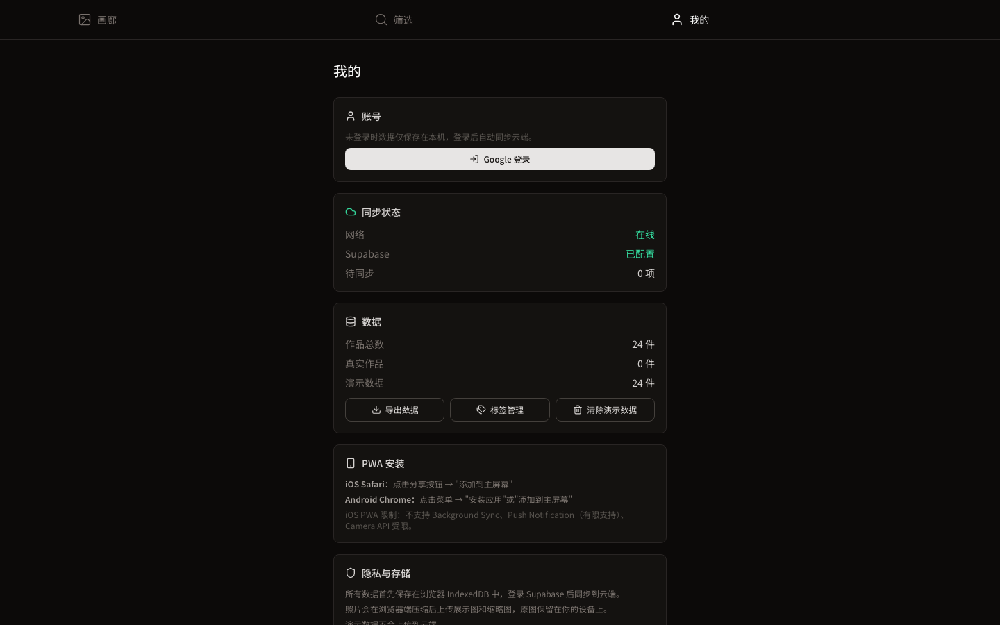
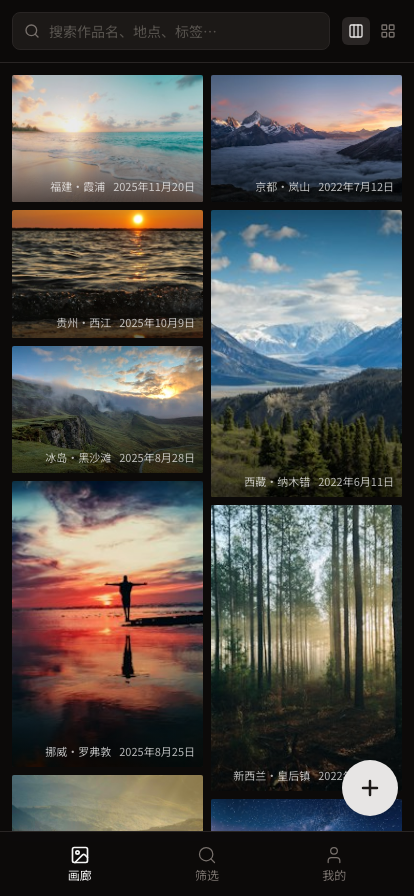

<div align="center">

[简体中文](README.md) · [English](README.en.md)

</div>

# 摄影作品库

私人自用的摄影作品库。把拍过的照片按地点、风格、构图和自定义标签整理起来，在画廊里慢慢翻、慢慢找。

数据先写进浏览器的 IndexedDB，界面立刻可见；登录之后，再由本地 outbox 推到你自己的 Supabase。



## 核心能力

- **画廊**：瀑布流与网格两种视图，灯箱浏览，窄屏优先。
- **分面筛选**：地点、风格、构图、年份、方向、收藏六个维度，可叠加；每个分面显示当前条件下的命中计数。
- **筛选结果可分享**：筛选条件写进 URL，复制链接即可回到同一批结果。
- **添加作品**：单张添加，或批量导入（一图一件）；批量导入时可粘贴一份按文件名匹配的标签 JSON。
- **标签管理**：地点、风格、构图、自定义标签的改名与删除，删除只移除引用，作品本身保留。
- **本地优先**：数据落 IndexedDB，不联网也能翻自己的库。
- **云同步**：Google 登录后同步到自建的 Supabase，使用独立 schema `photo_library`；演示数据不上传。
- **PWA**：构建产物带 Service Worker 与 manifest，可添加到主屏幕。

## 快速开始（最短上手）

```bash
pnpm install
pnpm dev
```

打开 http://localhost:5000 。首次打开会自动写入一批演示数据（24 件），
方便你先看清界面长什么样；不需要时在「我的 → 清除演示数据」里清掉。

macOS 上 `pnpm dev` 的清端口步骤依赖 `ss`（macOS 默认没有），那一步会静默跳过。
如果 5000 端口已被占用，等价写法是：

```bash
PORT=5000 pnpm tsx watch server/server.ts
```

## 界面

| 筛选与查找 | 添加作品 |
| --- | --- |
|  |  |

上表左侧是叠加了「风光 + 收藏」之后的筛选结果：活动筛选条列出当前条件，一键清除；
地点栏与各分面的计数随条件联动。

| 标签管理 | 我的 | 窄屏 |
| --- | --- | --- |
|  |  |  |

## 数据怎么走

写入永远是本地的：一次操作先落 IndexedDB 并更新界面，同时往 outbox 里记一条待推送记录。
登录之后由 outbox 按依赖顺序推送（先建父级再建子级，删除反过来），失败会带出具体原因。

不登录也能用，只是记录会一直排着队。「我的」页能看到待推送数量和同步状态。

演示数据（首次启动写入的那 24 件）带 `isDemo` 标记，同步时被拦下，不进云端。

## 环境变量

```bash
cp .env.example .env.local
```

| 变量 | 用途 |
| --- | --- |
| `VITE_SUPABASE_URL` | Supabase 项目地址。不填则云同步整体关闭，其余功能照常。 |
| `VITE_SUPABASE_PUBLISHABLE_KEY` | Supabase publishable key。同上。 |

这两个变量是公开的，构建时会进浏览器 bundle，只放 publishable / anon 级别的 key，
不要放 service role key。

## Docker 部署

```bash
docker compose up -d
```

宿主端口默认 8082，容器内 3000，健康检查打 `/healthz`。改端口用 `APP_PORT`：

```bash
APP_PORT=9000 docker compose up -d
```

镜像基于 Node 22，多阶段构建，构建阶段注入上面两个 `VITE_*` 变量，
运行阶段以非 root 用户起 Express 静态服务。

## 命令

| 命令 | 作用 |
| --- | --- |
| `pnpm install` | 安装依赖 |
| `pnpm dev` | 开发模式，端口 5000 |
| `pnpm build` | 构建前端 + 打包服务端 |
| `pnpm start` | 生产预览，端口 5000 |
| `pnpm ts-check` | TypeScript 类型检查 |
| `pnpm lint` | ESLint |

`pnpm test` 目前跑不通：仓库里没有测试文件（`.gitignore` 还忽略 `*.test.ts` / `*.test.tsx`），
执行会得到 `No test files found`。所以这里不列测试命令。

## 技术栈

React 19 · TypeScript · Vite 7 · Tailwind CSS 3 · React Router v7 · IndexedDB（idb）·
Supabase JS · vite-plugin-pwa · Lucide React · Express · pnpm 9

## 项目结构

```
src/
├── lib/          类型、分面配置、筛选引擎、IndexedDB、同步、Supabase、图片处理
├── components/   画廊网格、卡片、灯箱、分面侧栏与分面条、搜索、同步状态
├── pages/        Gallery / Find / WorkDetail / AddWork / TagsPage / Me
└── stores/       WorkStore（数据与同步状态的 Context）
server/           Express 开发与生产服务端
scripts/          dev / build / start 脚本
docs/             架构、数据库、部署、计划、QA、审查、交接
```

分面维度写在 `src/lib/facet-config.ts`，界面从配置读，不在组件里硬编码。

## 文档

- [AGENTS.md](AGENTS.md) — 协作入口与项目约定
- [架构：数据合同](docs/architecture/DATA_CONTRACT.md) · [分面引擎](docs/architecture/FACET_ENGINE.md) · [本地优先与同步](docs/architecture/LOCAL_FIRST_SYNC.md)
- [Supabase 接入方案](docs/db/SUPABASE_INTEGRATION_PROPOSAL.md)
- [部署交接（Mac mini + Docker）](docs/deployment/MAC_MINI_DOCKER_HANDOFF.md)
- [开发计划](docs/pm/PLAN.md) · [QA 清单](docs/qa/QA_CHECKLIST.md) · [Bug 清单](docs/qa/BUGS.md)
- [交接文档](docs/handoff/HANDOFF.md)

## 当前状态与已知限制

- 已发布：画廊、筛选、添加与批量导入、作品详情、标签管理、本地优先闭环、Supabase 云同步、Docker 部署。
  收口（M5）尚未完成。
- 同步侧有一处 outbox 依赖排序的修复已写进代码，**还没有跑过端到端实测**，暂按未验证对待。
- `pnpm test` 跑不通（见上）。
- 演示数据用的是 Unsplash 外链，**需要联网**；离线环境下这些图片会空。
- 「我的」页的「导出数据」按钮目前只有界面，没有实现。
- 仓库**没有 LICENSE 文件**，也**没有公开站点地址**（只有本机 dev 与自建 Docker），
  对外使用前请自行确认授权与部署方式。
- PWA 安装、iOS/Android 真机表现当前仓库未能验证。

个人项目，代码按看到的实际状态写，不做美化。